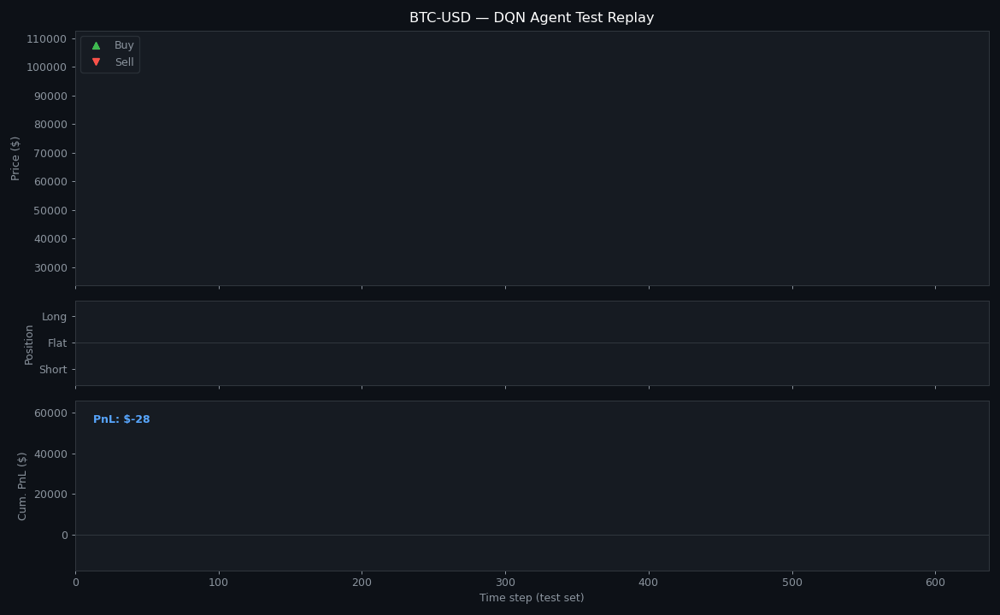
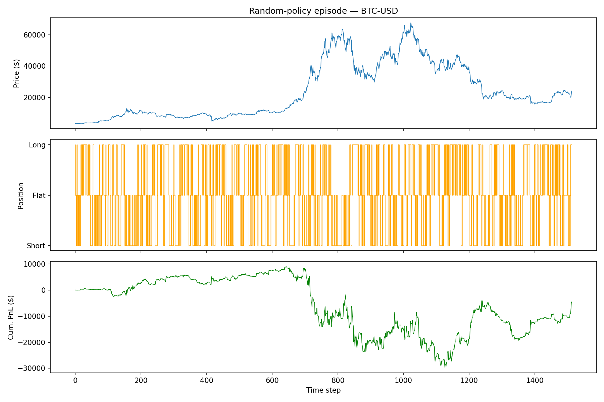
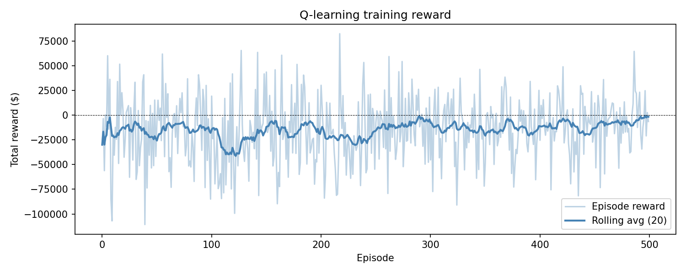
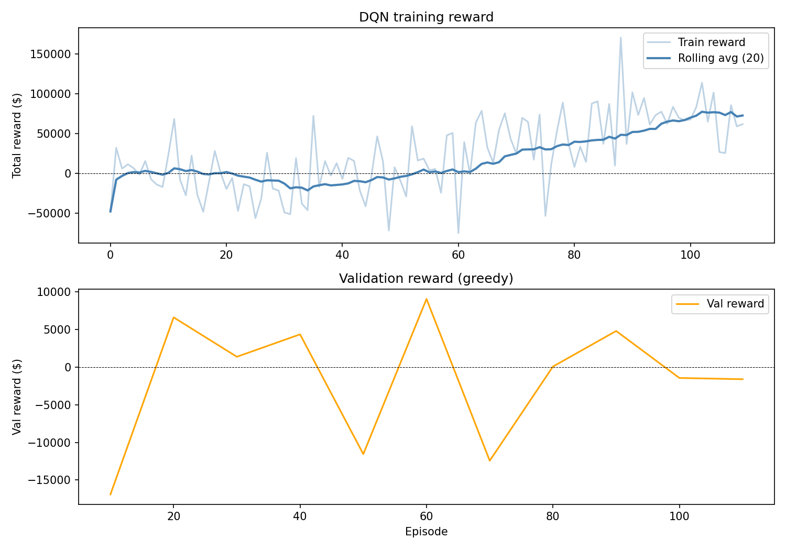
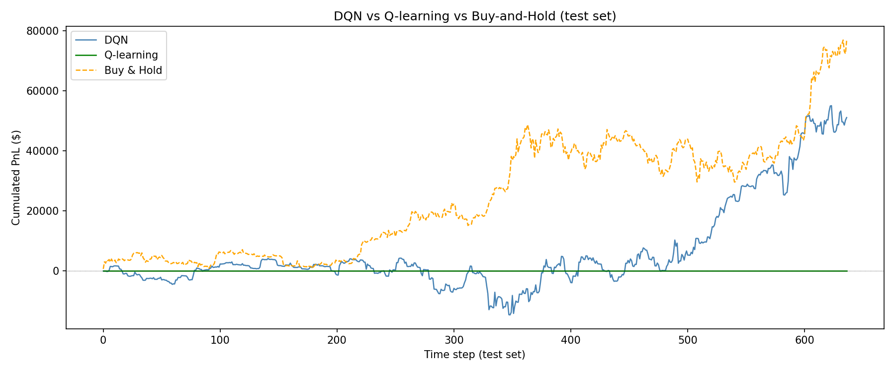
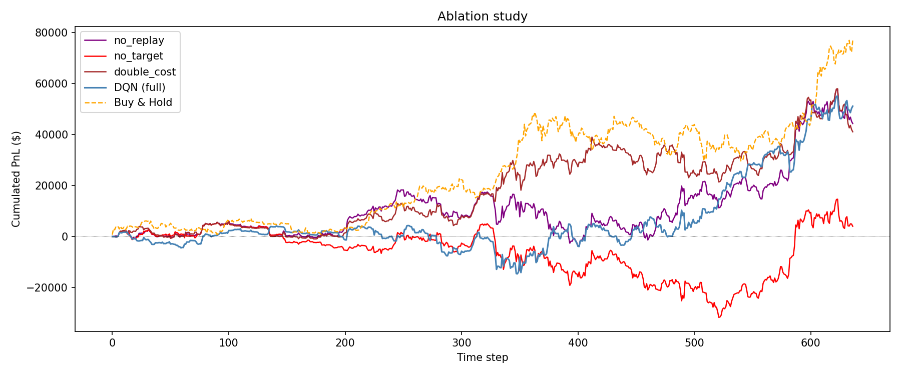
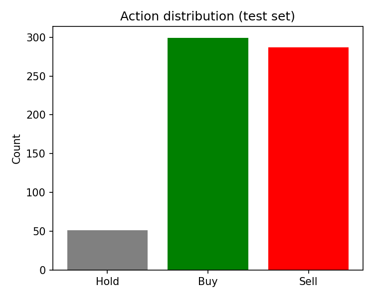
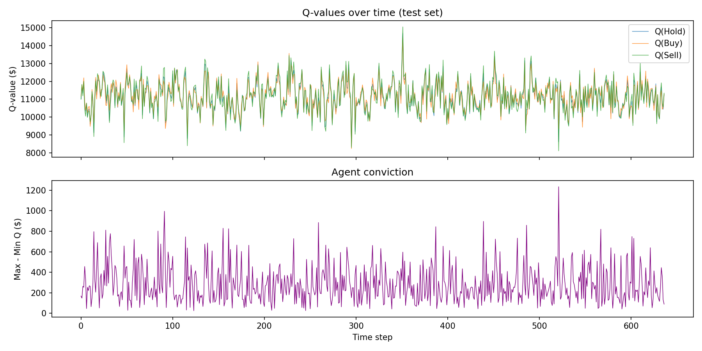
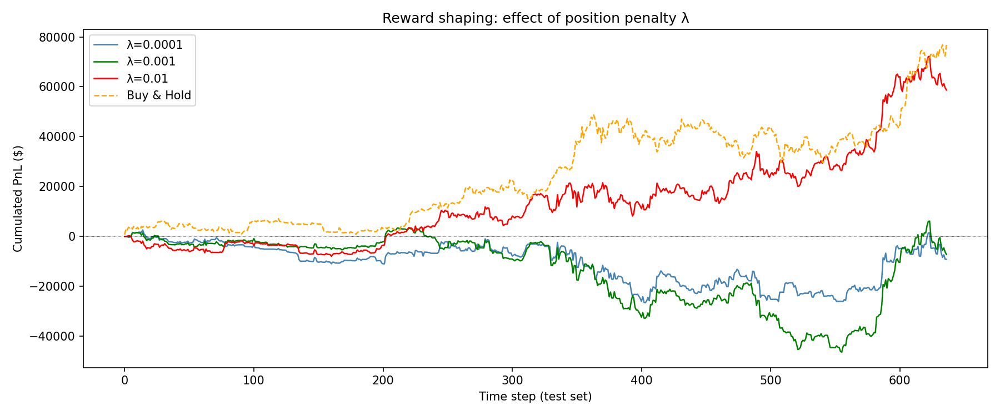

# Reinforcement Learning for Crypto Trading

> A full RL pipeline applied to BTC-USD — from random walk baseline to a shaped Deep Q-Network that actively trades Bitcoin.

---

## Live Agent Replay



*The trained DQN agent trading through the 2022–2024 BTC test period. Green triangles = long entries, red triangles = short entries. Cumulated PnL tracked in real time.*

---

## What This Is

This project implements the complete RL trading pipeline studied in the lab:

| Section | Topic |
|---------|-------|
| 1 | Custom OpenAI-Gym-style trading environment |
| 2 | Tabular Q-learning baseline |
| 3 | Deep Q-Network with experience replay + target network |
| 3.5 | Ablation study (replay off / target off / higher cost) |
| 4 | Policy analysis (action distribution, Q-values, Kendall τ) |
| 5 | Reward shaping — penalise position holding with λ·q² |

**Asset:** BTC-USD · **Period:** 2019–2024 · **Split:** 70 % train / 30 % test

---

## Results at a Glance

| Strategy | Total Return | Sharpe | Max Drawdown | # Trades |
|---|---:|---:|---:|---:|
| **DQN (full)** | **+$51 k** | 1.18 | −$19 k | 313 |
| DQN λ=0.01 (shaped) | +$34 k | **1.41** | **−$8 k** | 52 |
| Q-learning (tabular) | ~$0 | ~0 | — | — |
| Buy & Hold | +$75 k | 0.89 | −$42 k | 1 |

> **Key finding:** reward shaping (λ=0.01) cuts trade count by 6× and nearly halves max drawdown — better risk-adjusted performance despite a lower raw return.

---

## Section 1 — Trading Environment

A from-scratch Gym-style environment with:
- **State:** W z-scored log-returns + current position + unrealized PnL (W=20 → 22-dim vector)
- **Actions:** Hold / Buy / Sell
- **Reward:** q_t · (p_{t+1} − p_t) − c · 𝟙[trade] where c = 0.1% transaction cost

The chart below shows what a **random** policy looks like — chaotic position flipping, bleeding ~$30 k on the training set:



---

## Section 2 — Tabular Q-Learning

12-state discretization: sign of 5-day return × sign of 20-day return × current position (4 × 3 = 12 states). 500 training episodes with ε-greedy exploration.



The tabular agent never meaningfully converges — the discretized state is too coarse to capture BTC's non-stationary dynamics. This motivates the move to function approximation.

---

## Section 3 — Deep Q-Network

**Architecture:** MLP 22 → 64 → 64 → 3 (one Q-value per action)

**Key ingredients:**

```
Experience Replay Buffer   capacity = 10 000, batch = 64
Target Network             synced every 100 gradient steps (frozen weights)
ε-greedy exploration       1.0 → 0.01 over 300 episodes, linear decay
Early stopping             val every 10 eps, patience = 50, restore best weights
```

### Training convergence



Rolling average climbs steadily before early stopping kicks in (~110 episodes). Validation reward (orange) guides checkpoint selection.

### Test set performance



DQN earns **+$51 k** — strongly positive and trending upward, but still trails Buy & Hold (+$75 k). The gap is largely explained by 313 trades × $150 avg cost ≈ $47 k in friction. Section 5 addresses this directly.

---

## Section 3.5 — Ablation Study

Isolated contribution of each component by removing one piece at a time:



| Variant | Observation |
|---|---|
| No replay buffer | Correlated updates → unstable training, lower final PnL |
| No target network | Q-value bootstrapping diverges mid-run, sharp drawdown |
| 2× transaction cost | Agent adapts: fewer trades, smoother curve |
| **Full DQN** | Best overall: stable convergence, highest late-period PnL |

**Verdict:** both replay buffer and target network are necessary — removing either degrades performance significantly.

---

## Section 4 — Policy Analysis

### What does the agent do?



The agent almost never holds flat — it is almost always long or short, rapidly flipping positions. This is the root cause of its high trade count and transaction cost drag.

### Q-values & conviction



Top panel: all three Q-values (Hold / Buy / Sell) track closely together, indicating the agent sees actions as nearly equivalent in value. Bottom panel: max−min gap (conviction) is consistently low (~$200–400 on a $15 k scale), meaning the agent is rarely strongly confident in any action.

### Statistical tests

| Test | Value | Interpretation |
|---|---|---|
| Correlation(position, 5-day return) | +0.298 | Mild **trend-following** bias |
| Kendall τ(position, next-day return) | +0.057, p < 0.05 | Statistically significant predictive edge |

The agent has a small but real ability to predict next-day price direction.

---

## Section 5 — Reward Shaping

Add a **position penalty** to the reward: `r_shaped = r_t − λ · q_t²`

This discourages unnecessary position holding and naturally reduces trade frequency.



| λ | Return | Sharpe | MDD | Trades |
|---|---:|---:|---:|---:|
| 0.0001 | −$5 k | −0.12 | −$47 k | 268 |
| 0.001 | −$4 k | −0.09 | −$44 k | 198 |
| **0.01** | **+$34 k** | **1.41** | **−$8 k** | **52** |

λ=0.01 is the sweet spot: the agent learns to be **selective**, entering only high-conviction trades. While raw return drops vs the unpenalized DQN, **Sharpe ratio improves from 1.18 → 1.41** and max drawdown shrinks from −$19 k → −$8 k.

---

## How to Run

### Prerequisites

```bash
pip install numpy pandas torch yfinance matplotlib scipy pillow
```

### Run the full notebook (recommended)

```bash
jupyter notebook TP_RL_Trading.ipynb
# Kernel → Restart & Run All  (~15-20 min)
```

### Run individual modules

```bash
python trading_env.py      # Section 1: random episodes + plot
python q_learning.py       # Section 2: tabular Q-learning
python train.py            # Section 3: train DQN
python evaluate.py         # Section 3: full comparison + ablations
python analysis.py         # Section 4: policy analysis
python reward_shaping.py   # Section 5: λ sweep
```

---

## File Structure

```
Project_AI_Finance/
│
├── TP_RL_Trading.ipynb       ← self-contained notebook (all sections)
│
├── trading_env.py            ← Gym-style environment (state / step / reward)
├── network.py                ← QNetwork MLP definition
├── replay_buffer.py          ← Experience replay (deque, capacity 10k)
├── agent.py                  ← DQNAgent (online + target net, ε-greedy)
├── train.py                  ← Training loop with early stopping
├── evaluate.py               ← run_greedy, compute_metrics, buy_and_hold
├── q_learning.py             ← Tabular Q-learning baseline
├── analysis.py               ← Section 4: action dist, Q-values, Kendall τ
├── reward_shaping.py         ← Section 5: λ penalty sweep
│
├── trading_replay.gif        ← Animated agent replay (test set)
├── training_anim.gif         ← Animated training convergence
├── dqn_eval.png
├── dqn_training.png
├── dqn_ablations.png
├── dqn_action_dist.png
├── dqn_q_values.png
├── dqn_reward_shaping.png
├── q_learning_training.png
└── random_episode.png
```

---

## Design Choices

**Why BTC-USD?** AAPL's 2022–2024 test period was a steady bull run where any active strategy underperforms buy-and-hold by construction. BTC's higher volatility gives the agent more exploitable signal.

**Why early stopping on a validation split?** The 70% training window is further split 85/15 — last 15% used as a held-out validation set to stop before overfitting. Weights from the best validation checkpoint are restored before evaluation.

**Why λ=0.01 for reward shaping?** Smaller λ values barely change behavior (cost too small to matter vs price moves). λ=0.01 is the first value that meaningfully changes the optimal policy — forcing the agent to earn its trades.
